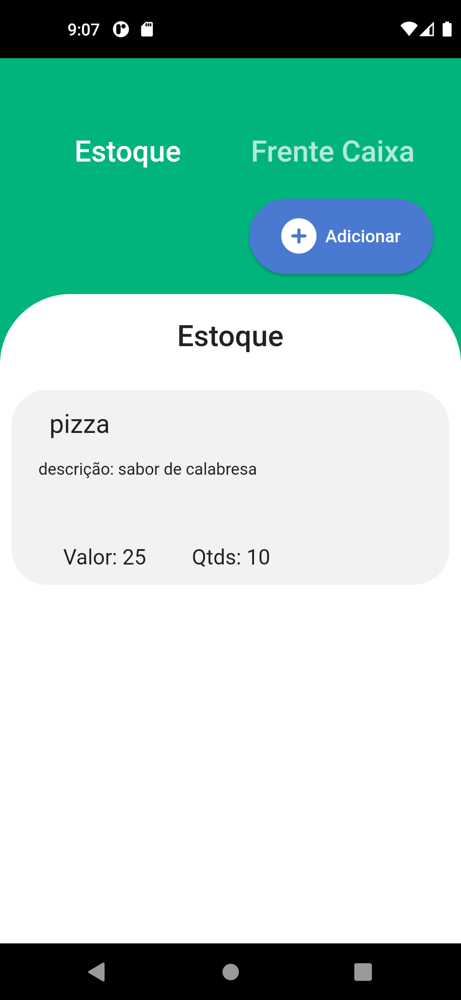

# Aplicativo gestão de caixa Beta

Projeto de aplicativo feito em flutter com. Objetivo deste aplicativo é auxiliar e ajudar o usuario no controle de finanças,estoque e vendas

## Download disponivel do app versão beta

[Download aplicativo Gestão de caixa](https://www.instagram.com/marco0antonio_/)

## Ferramentas utilizadas
*   Linguagem flutter,dart,sqlite(sqflite)
*   Design de telas realizado atravez do aplicativo figma desktop

##  Pagina -- Estoque

## Redes sociais

